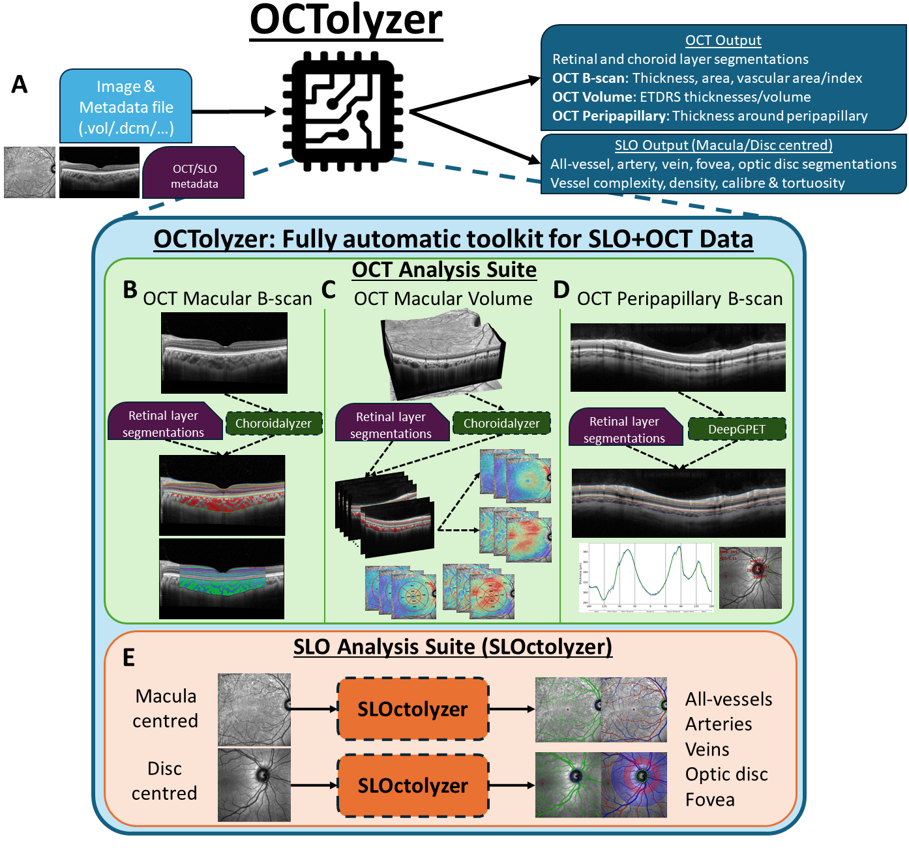
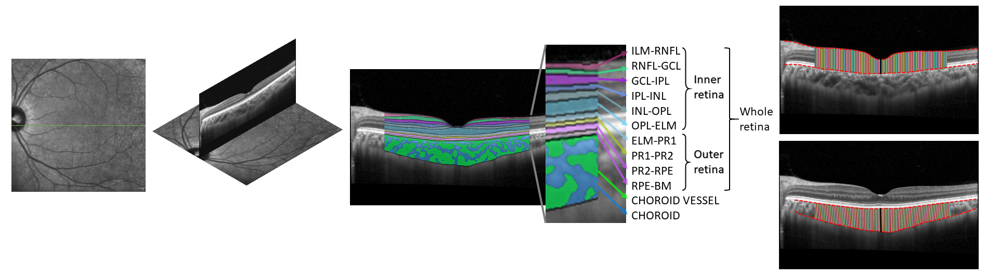
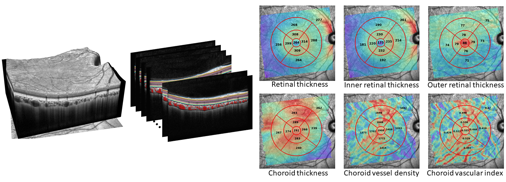
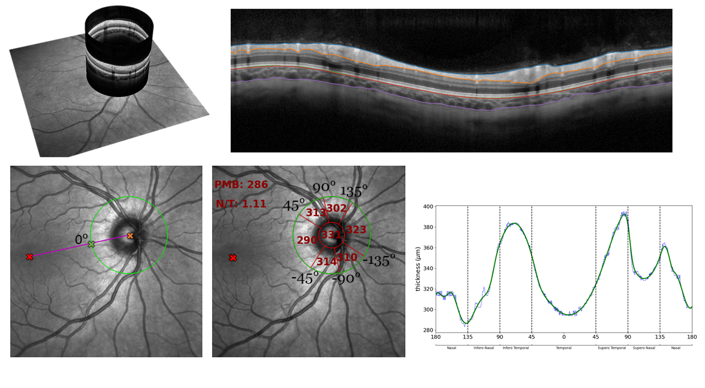

# OCTolyzer: A fully automatic toolkit for segmentation and feature extracting in optical coherence tomography (OCT) and scanning laser ophthalmoscopy (SLO) data

OCTolyzer is a fully automatic pipeline capable of fully characterising the retinal and choroidal layers as seen on cross-sectional OCT images. It also supports segmentation and analysis of the en face retinal vessels on the corresponding confocal, infra-red scanning laser ophthalmoscopy (SLO) image, with additional detection of the fovea and optic disc. The pipeline utilises several fully automatic deep learning methods for segmentation of the OCT choroid and en face retinal vessels, and utilises the OCT retinal layer segmentations from the imaging device's built-in software, acessible from from file metadata, for generating retinochoroidal OCT measurements and en face retinal vessel measurements.

Please find the pre-print describing OCTolyzer's pipeline [here](https://arxiv.org/abs/2407.14128).

OCTolyzer is also capable of extracting clinically-relevant features of interest of the retina and choroid. The code used to measure regional and spatial measurements from OCT images was developed in-house, while the code used to measure features of en face retinal vessels were based on the code produced by [Automorph](https://tvst.arvojournals.org/article.aspx?articleid=2783477), whose codebase can be found [here](https://github.com/rmaphoh/AutoMorph).

See below for a visual description of OCTolyzer's analysis pipeline.

<p align="center">
  
</p>

---

## Table of contents

- [File structure](#file-structure)
- [Getting started](#getting-started)
    - [Quick start](#quick-start)
- [OCTolyzer's support](#octolyzers-support)
    - [OCT scan patterns](#oct-scan-patterns)
    - [OS compatibility](#os-compatibility)
- [OCTolyzer's pipeline](#octolyzers-pipeline)
    - [Segmentation](#segmentation)
        - [Macular OCT B-scan](#macular-oct-b-scan)
        - [Peripapillary OCT B-scan](#peripapillary-oct-b-scan)
        - [En face SLO](#en-face-slo)
    - [Feature measurement](#feature-measurement)
        - [OCT](#oct)
            - [Single-line macular B-scan](#single-line-macular-b-scan)
            - [Posterior pole macular scan](#posterior-pole-macular-scan)
            - [Peripapillary B-scan](#peripapillary-b-scan)
        - [SLO](#slo)
    - [Execution Time](#execution-time)
- [Fixing segmentation errors](#fixing-segmentation-errors)
- [Debugging](#debugging)
    - [Interactive debugging](#interactive-debugging)
- [Related repositories](#related-repositories)
- [Contributors and citing](#contributors-and-citing)
- [Updates](#updates)


---

## File stucture

```
.
├── figures/		# Figures for README
├── instructions/	# Instructions, installation, manual annotation help
├── octolyzer/	# core module for carrying out segmentation and feature measurement
├── config.txt		# Text file to specify options, such as the analysis directory path.
├── README.md		# This file
└── usage.ipynb		# Demonstrative Jupyter notebook to see usage.
```


- The code found in `octolyzer`
```
.
├── octolyzer/                             
├───── measure/		# Feature extraction
├───── segment/		# Segmentation inference modules.
├───── __init__.py
├───── analyse.py	# Script to segment and measure a single OCT+SLO .vol file and save out results. Can be used interactively via VSCode or Notebooks.
├───── analyse_slo.py	# Script for SLO image analysis, adapted from SLOctolyzer.
├───── collate_data.py	# Combine individual file results for collating into single, summary file for batch processing.
├───── main.py		# Wrapper script to run OCTolyzer from the terminal for batch processing.
└───── utils.py		# Utility functions for plotting and processing segmentations.
```

---

## Getting started

To get a local copy up follow the steps in `instructions/quick_start.txt`, or follow the instructions below.

1. You will need a local installation of Python to run OCTolyzer. We recommend a lightweight package management system such as Miniconda. Follow the instructions [here](https://docs.anaconda.com/free/miniconda/miniconda-install/) to download Miniconda for your desired operating system.

2. After downloading, navigate and open the Anaconda Prompt and clone the OCTolyzer repository.

```
git clone https://github.com/jaburke166/OCTolyzer.git
```

3. Create environment and install dependencies to create your own environment in Miniconda.

```
conda create -n oct-analysis python=3.11 -y
conda activate oct-analysis
pip install -r requirements.txt
```

Done! You have successfully set up the software to analyse SLO and OCT image data!

Now you can:

1. Launch notebooks using `jupyter notebook` or jupyter labs using `jupyter lab` and see the minimal example below so that you can analyse your own SLO+OCT data.

2. Alternatively, edit the `analysis_directory` and `output_directory` options in `config.txt` and run `python path\to\OCTolyzer/octolyzer/main.py` to batch process your own OCT+SLO dataset.

If you have any problems using this toolkit, please do not hesitate to contact us - see the end of this README for contact details!

### Quick start

Please refer to `usage.ipynb` for an interactive demonstration of analysing SLO+OCT data. The first cell is copied below as the minimal example which loads in the demonstrative data found in `demo/input` and processes the first `.vol` file.

```
# Load necessary modules
from octolyzer import utils, analyse
from pathlib import Path

# Detect images in analyze/demo
paths = sorted(Path("demo/input").glob(f"*.vol"))
path = paths[0]
save_path = "demo/output"

# Analyse SLO+OCT data - saved out in analyze/output/ into a folder whose name is the filename of the image
output = analyse.analyse(path, save_path)
# output is a tuple containing the results from the SLO analysis and OCT analysis separately
# Each tuple stores relevant (metadata, feature measurements, segmentations, logging)
```

**note**: The exemplar posterior pole volume data (`demo/Ppole_1.vol` and `demo/Ppole_2.vol`) capture a smaller region of interest (~4.5mm) on the macula than the feature measurement assumes (ETDRS circular grid with radii 1mm,3mm,6mm / 8x8 posterior pole chess grid of width 7mm), so naturally there will be warnings of missing values in many of the subfields.

---

## OCTolyzer's support

At present, OCTolyzer only supports `.vol` files (native to Heidelberg Engineering), but there are plans in future to support more vendor neutral file formats such as `.dcm`. 

We do not support `.e2e` files because current python-based file readers ([EyePy](https://github.com/MedVisBonn/eyepy/tree/master/src/eyepy), [OCT-Converter](https://github.com/marksgraham/OCT-Converter)) cannot locate the necessary pixel lengthscales to convert from pixel space to physical space. Moreover, we do not support regular image files because of the necessity to convert measurements from pixel space to physical space for standardised reporting of ocular measurements. Please do get in touch if you would like to help extend OCTolyzer on other file formats - see contact information at the end of this file!

See the documents in the `instructions` folder for details on installing and using OCTolyzer on your device. 

Briefly, OCTolyzer can be run from the terminal using `main.py` for analysing batches of data, or using `analyse.py` individually per file using your favourite, interactive IDE such as [VSCode](https://code.visualstudio.com/download) or [Jupyter Notebooks](https://jupyter.org/).

When using the terminal, you can specify certain input parameters using a configuration file, `config.txt`. Here, you can specify the `analysis_directory` and `output_directory`, i.e., where your data is stored and where you wish to save results to, respectively.

### OCT scan patterns

Currently, OCTolyzer supports fully automatic analysis of three `.vol` data types:

- Single, horizontal- or vertical-line macular OCT B-scans
- Posterior pole, macular OCT scans.
- Single, circular peripapillary OCT B-scans
- Radial, macular OCT scans.

These were the only OCT data types which the developers had access to, and thus could set up analysis streams for (after unpacking the files using [EyePy](https://github.com/MedVisBonn/eyepy/tree/master/src/eyepy)). However, OCTolyzer is an evolving toolkit, so we expect other scan patterns to be supported if and when there is need for it. Check out `octolyzer/utils.py` for function `load_volfile()` to see how your scan pattern may be loaded in and supported and contact us! 

### OS compatibility

At present, OCTolyzer is compatible with Windows and macOS operating systems. Given the compatibility with macOS, it's likely that Linux distributions will also work as expected, although has not been tested explicitly. The installation instructions are also the same across operating systems (once you have installed the relevant Miniconda Python distributions for your own operating system). 

Once OCTolyzer is downloaded/cloned and the conda environment/python packages have been installed using the commands in `instructions/install.txt`, it is only the file path structures to be aware of when switching between OS, i.e. in the configuration file, `config.txt`, the `analysis_directory` and `output_directory` should be compatible with your OS.

---

## OCTolyzer's pipeline

### Segmentation

We do not provide functionality (yet) for automatic OCT retinal layer segmentation, but the automatic layer segmentations provided by Heidelberg's built-in software can be accessed directly from the `.vol` metadata for downstream measurements. 

#### Macular OCT B-scan

We use [Choroidalyzer](https://github.com/justin.engelmann/Choroidalyzer) for OCT choroid segmentation of macular OCT scans (single-line B-scans and posterior pole scans). Choroidalyzer segments the choroidal space, vessels and detects the fovea on OCT B-scans. See [here](https://iovs.arvojournals.org/article.aspx?articleid=2793719) for the paper describing Choroidalyzer.

#### Peripapillary OCT B-scan

We use [DeepGPET](https://github.com/jaburke166/deepgpet) for OCT choroid segmentation of peripapillary OCT B-scans. DeepGPET only segments the choroidal space on the B-scan. **Note**: Choroidal vessels are not segmented on peripapillary B-scans currently. See [here](https://tvst.arvojournals.org/article.aspx?articleid=2793042) for the paper describing DeepGPET.

#### En face SLO

For SLO images, we have three separate deep learning-based models. One for binary vessel segmentation of the en face retinal vessels, and another for segmentation of the en face retinal vessels into arteries and veins, and simultaneous detection of the optic disc. A final, third model only detects on the fovea on the en face SLO image. Please see the paper describing OCTolyzer's SLO analysis suite, [SLOctolyzer](https://tvst.arvojournals.org/article.aspx?articleid=2802220). SLOctolzyer is also a stand-alone image analysis pipeline for SLO images (supporting both `.vol` and regular image files), and can be accessed and used freely [here](https://github.com/jaburke166/SLOctolyzer).

### Feature measurement

#### OCT

At present, OCTolyzer provides a suite of measurements for each of the three OCT data types which it supports:

##### Single-line macular B-scan

Given some region of interest around the fovea (dictated by `linescan_roi_distance` in `config.txt` as a micron value around the fovea), area (in mm$^2$), average thickness and subfoveal thickness (in $\mu$m) will be measured for every available layer. Additionally for the choroid, vessel area and vascular index will also be measured and outputted. See below for a visualisation taken from the paper:

<p align="center">
  
</p>

**A note on radial scan patterns**: Radial scans are also compatibile, where multiple macular line-scans are collected radially around the fovea. These are processed as multiple single-line macular B-scans, and the measurements are saved out row-wise, ordered anti-clockwise from the horizontal-line scan.

**A note on choroid measurements**: On occasion the choroid may appear skewed relative to the image axis, and this curvature can be accounted for by defining the the region of interest according to the *choroid axis*. By default, measurements of the choroid are made locally perpendicular to this axis with `choroid_measure_type` set to `perpendicular`. If this option is set to `vertical`, then the choroid is measured corresponding to the *image axis*, i.e. per A-scan (like the retina is, by default). In the above image, note the thickness measurements in the choroid are perpendicular to the upper boundary, but for the retina they are vertical. This option is only valid for macular OCT choroid image analysis, and not for peripapillary OCT choroid image analysis (as the local choroid curvature is due to the circular nature of the B-scan).

##### Posterior pole macular scan

Thickness maps for all available retinal layers are generated, alongside choroid thickness, vessel density and vascular index maps. Volume maps are also generated for all metrics except for choroid vascular index. 

Maps are then quantified by default using the ETDRS grid which define three concentric circles of diameter 1mm (central), 3mm (inner) and 6mm (outer). Inner and outer circles are split into four equally sized quadrants which permits measuring 9 distinct subfields in the macula. Additional quantification of the map using an 8x8 posterior pole grid (7 mm square width) can also be done by setting `analyse_square_grid` to `1` in `config.txt`. If individual retinal layer segmentations are available, then you can specify `analyse_all_maps` to `1` to quantify all of these, or specify custom maps using the `custom_maps` option. 

See below for a visualisation taken from the paper of choroidal/retinal maps along the macula, with the ETDRS grid overlaid in red and measurements per subfield superimposed:

<p align="center">
  
</p>

**Note**: If the volume scan does not span the ETDRS grid (6mm in diameter), then subfield feature measurements will be innaccurate in regions not captured on the OCT. This is most apparently in `demo/input/Ppole_1.vol` and `demo/input/Ppole_2.vol`.

##### Peripapillary B-scan

Average thickness in each of the six radial, peripapillary grids are measured, after aligning the centre of the temporal peripapillary grid with the detected fovea on the corresponding SLO image. To align the peripapillary grid properly, the localiser SLO image must be available. If the SLO is unavailable, the alignment of the peripapillary grid is likely to off-centre from the fovea. We also output the nasal-to-temporal ratio and average thickness in the papillomacular bundle. Thickness profiles around the disc are also quantified and saved out optionally. 

See below for a visualisation taken from the paper:

<p align="center">
  
</p>

**Note**: Choroid analysis can be toggled off by setting `analyse_choroid` to `0` in `config.txt`.


#### SLO

At present, the features measured on the SLO image across the whole image are:
- Fractal dimension (dimensionless)
- Vessel perfusion density (dimensionless)
- Global vessel calibre (computed globally in microns or pixels, dependent on whether a conversion factor is specified, see below)

Additionally, for smaller regions of interest, zones B and C, and the whole image, the following measurements will be measured in pixels or microns, dependent on whether the conversion factor is specified (see below):
- Tortuosity density
- Local vessel calibre (similar to average vessel width, but computed and averaged across individual vessel segments)
- CRAE (for detected arteries only) using Knudston's formula
- CRVE (for detected veins only) using Knudston's formula
- arteriolar–venular ratio (AVR), which is CRAE divided by CRVE.

**A note on tortuosity**: A current limitation of the pipeline surrounds artery and vein map disconnectedness. Artery-vein crossings on the SLO are segmented such that only artery OR vein is classified, not both. This was an oversight at the point of ground truth annotation before model training. Thus, the individual artery/vein maps are disconnected. Unfortunately, this may have an impact on tortuosity density measurements.

**Note**: SLO analysis can be toggled off by setting `analyse_slo` to `0` in `config.txt`. This will reduce execution time.

### Execution time

OCTolyzer can run reasonably fast using a standard, GPU-less Windows laptop CPU. For only running the OCT analysis suite (i.e., `analyse_slo` set to `0`).

- ~2 seconds for a single line OCT B-scan (pixel resolution $496 \times 768)$.
- ~85 seconds for an OCT volume with thickness maps computed and measured for every retinochoroidal layer (pixel resolution $61 \times 496 \times 768$).
- ~3 seconds for an OCT peripapillary B-scan (pixel resolution $768 \times 1536)$. **Note**: To align the peripapillary grid, the localiser SLO image must be available, and the fovea and optic disc must be segmented, which increases execution time to around 30 seconds. If the SLO is unavailable, the alignment of the peripapillary grid is likely to off-centre from the fovea.

**Note**: Execution time increases when the SLO analysis suite is toggled on (`analyse_slo` set to `1`), particularly for disc-centred SLO images (OCT peripapillary scans), because there are three regions of interest measured for each vessel type (all-vessel, artery, veins).

---

## Fixing segmentation errors

We do not have any automatic functionality within OCTolyzer to correct any segmentation errors. Thus, we rely on the user to identify any visible problems with vessel classification.

However, we do provide functionality to manually correct en face retinal vessel segmentations and foveola centralis on the SLO via ITK-Snap. There are instructions on using ITK-Snap for manual annotations in `instructions/SLO_manual_annotations` which describe how to setup ITK-Snap and use it to correct the binary vessel mask, and/or the artery-vein-optic disc segmentation mask, and/or the fovea segmentation mask. 

Once the corrected segmentations are saved out as `.nii.gz` files in the same folder with the original `.png` segmentation mask(s), the pipeline can be run again and OCTolyzer should automatically identify these additional manual annotations and re-compute the features!

---

## Debugging

If you have any issues with running this toolkit on your own device, please contact us (see end of README for contact email). 

This project and analysis toolkit is an evolving toolkit, so we are expecting unexpected errors to crop up on use-cases which the developers have not foreseen. We hope this pipeline will continue to be adapted to the needs of the end-user, so we welcome any and all feedback!

At the moment, setting `robust_run` to `1` will ensure that batch-processing does not fail if an unexpected error is caught. In fact, if an exception is found, details on the error in terms of it's type and full traceback are saved out in the process log (as well as printed out on the terminal/IDE) so the end-user may interrogate the codebase further and understand the source of the error.

### Interactive debugging

In the folder `debugging/` there are four jupyter notebooks which take a step-by-step (or, cell-by-cell) approach to OCTolyzer's analysis pipeline for the four scan patterns which OCTolyzer supports: single-line, radial, posterior pole and peripapillary. 

For a `.vol` file (of a particular scan pattern) which fails to be analysed, an end-user with minimal experience in Python should be able to try run the corresponding notebook and understand at what point of the pipeline the software fails. This is particularly helpful for raising Issues on the Github repository so that a developer can better understand the problem.

---

## Related repositories

If you are interested in only scanning laser ophthalmoscopy image analysis, check this repoistory out:

* [SLOctolyzer](https://github.com/jaburke166/SLOctolyzer): Analysis toolkit for automatic segmentation and measurement of retinal vessels on scanning laser ophthalmoscopy (SLO) images

If you are interested in automatic choroid analysis in OCT B-scans specifically, check these repositories out:

* [Choroidalyzer](https://github.com/justinengelmann/Choroidalyzer): A fully automatic, deep learning-based tool for choroid region and vessel segmentation, and fovea detection in OCT B-scans.
* [DeepGPET](https://github.com/jaburke166/deepgpet): fully automated choroid region segmentation in OCT B-scans.
* [MMCQ](https://github.com/jaburke166/mmcq): A semi-automatic algorithm for choroid vessel segmentation in OCT B-scans based on multi-scale quantisation, histogram equalisation and pixel clustering.

If you are interested in colour fundus photography (CFP) image analysis, check this repository out:

* [AutoMorphalyzer](https://github.com/jaburke166/AutoMorphalyzer): A fully automatic analysis toolkit for segmentation and feature extracting in CFP data, a restructured version of [AutoMorph](https://github.com/rmaphoh/AutoMorph).
---

## Contributors and citing

The contributors to this method and codebase are:

* Jamie Burke (Jamie.Burke@ed.ac.uk)

If you wish to use this toolkit please consider citing our work using the following BibText

```
@article{burke2024octolyzer,
  title={OCTolyzer: Fully automatic analysis toolkit for segmentation and feature extracting in optical coherence tomography (OCT) and scanning laser ophthalmoscopy (SLO) data},
  author={Burke, Jamie and Engelmann, Justin and Gibbon, Samuel and Hamid, Charlene and Moukaddem, Diana and Pugh, Dan and Farrah, Tariq and Strang, Niall and Dhaun, Neeraj and MacGillivray, Tom and others},
  journal={arXiv preprint arXiv:2407.14128},
  year={2024}
}
```

---

## Updates

### 25/03/2025

* Improved efficiency of feature measurement pipeline for OCTolyzer's SLO analysis suite, replacing [AutoMorph's](https://github.com/rmaphoh/AutoMorph) vessel width measurements with those used by [AutoMorphalyzer](https://github.com/jaburke166/AutoMorphalyzer).

### 02/02/2025

* Updated `README.md` structure and included a table of contents.

* Included a `requirements.txt` file to ensure proper installation of dependencies with OCTolyzer's pipeline. 

* Added demonstrative `.vol` data in `demo/input`, taken from [here](https://github.com/halirutan/spectralis-raw-data/tree/master/test-data) using the `Willis_*.vol` files.

* Added debugging jupyter notebooks in `debugging/` for end-users with minimal experience in Python to better understand why a `.vol` file might have failed during processing.

* Updated the majority of important functions with detailed docstrings to allow for reproducibility and transparency for end-users.
  - Scripts related to segmentation inference and SLO analysis still remain to be cleaned up with improved docstrings. 

* Compatibility with `.vol` files with a radial scan pattern.
  - OCTolyzer can now load in radial scan patterns and process each B-scan in sequence. Saving out of features is done in an clockwise order from the Vertical-line B-scan.
 
* Generalised macular analysis to smaller regions of interest captured.
  - Posterior pole analysis pipeline now accounts for when the SLO and OCT lateral pixel resolutions are different.
  - Linescan analysis now checks to see if ROI captured on OCT is large enough for distance to measure (`bscan_ROI_mm` > `macula_rum`).

* Minor bug in generalising loading of peripapillary scan patterns.
  - Previously, `utils.load_volfile` assumed that peripapillary scan patterns from Heidelberg devices had a lateral pixel resolution of 1536. This has been corrected to become more generalisable.
  - Fixed bug which swapped the pixel coordinates defining the centre and edge of the peripapillary acquisition (circular) location.


### 20/11/2024

* Additional functionality to manually correct the foveola centralis on the SLO using ITK-Snap.
  - In a similar style to manual correction of retinal vessels, ITK-Snap is used to manually select the region of the fovea.
  - See "Fixing segmentation errors" above for brief information on how this correction is passed to OCTolyzer.
  - For more detailed instructions, see the instruction document at `instructions/SLO_manual_annotations`.

* Error handling with invalid segmentations in posterior pole volume scan processing
  - Any anomolous segmentations detected that may arise from, say, a clipped B-scan in the stack are set to 0 and ignored in the map generation. 
  - During measurement, these are treated as missing values and, like normal, interpolated over (linearly).

* Minor bug in interpolating over missing values in peripapillary B-scan segmentations
  - Corrected a single pixel indexing issue when padding thickness array to deal with missing values


### 24/10/2024

* Improved visualisations of segmentations and regions of interest (ROI) for H-line/V-line B-scans:
  - Provide support for scans which the pipeline fails to identify the fovea for, including the addition of a flag to metadata on whether OCT fovea was detected (`bscan_missing_fovea`).
  - Overlay ROI onto OCT B-scan segmentation image (green shaded background with legend stating size of ROI). This disappears if measurements were not computed (see point below).
  - Added end-user log outputs in case measuring fails for a H-line/V-line scan due to too large an ROI (via `linescan_roi_distance`) or too short a segmentation.

* Improved visualisations of segmentations and regions of interest (ROI) for Ppole scans (at present, only valid for 31-stack and 61-stack volumes):
  - Saved out single, fovea-centred B-scan from the volume stack separately with segmentations overlaid for inspection.
  - Save out high-res composite image of all remaining B-scans from volume stiched together with segmentations overlaid for inspection.


### 22/10/2024

* Peripapillary B-scan analysis:
  - Thickness arrays padding wraps instead of reflects.
  - Colinear alignment between optic disc centre, en face fovea and acquisition line fixed given assumed acquisition moves clockwise from clock position "3".
  - Peripapillary subfield definition have more flexibility to rotate during alignment, given position of en face fovea.
  - Interpolate over any missing values in peripapillary thickness array.
  - When rotating peripapillary grid, suppress warning when taking remainder of 0.

* Removal and renaming of en face retinal vessel features to align with SLOctolyzer's current set of features:
  - Tortuosity distance ("tortuosity_curvebychord") and Squared curvature tortuosity ("tortuosity_sqcurvature") are removed, due to vessel map disconnectedness overexaggerating features.
  - Renaming "average_width_all" to "global vessel calibre", "average_caliber" to "local vessel calibre" and "vessel_perf_density" to "vessel_density" for better clarity of their definitions.

* Removed `octolyzer/measure/bscan/ppole_measurements.py` as it is not used.


### 29/07/2024

* Initial commit of OCTolyzer
 
 
 
 
 
 
 
 

